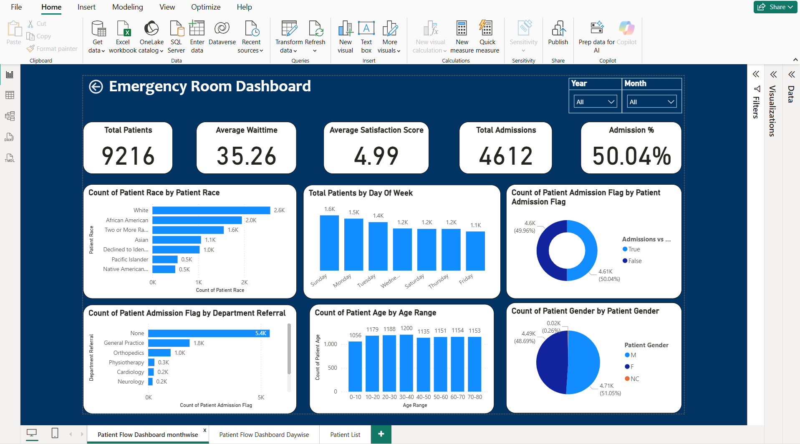
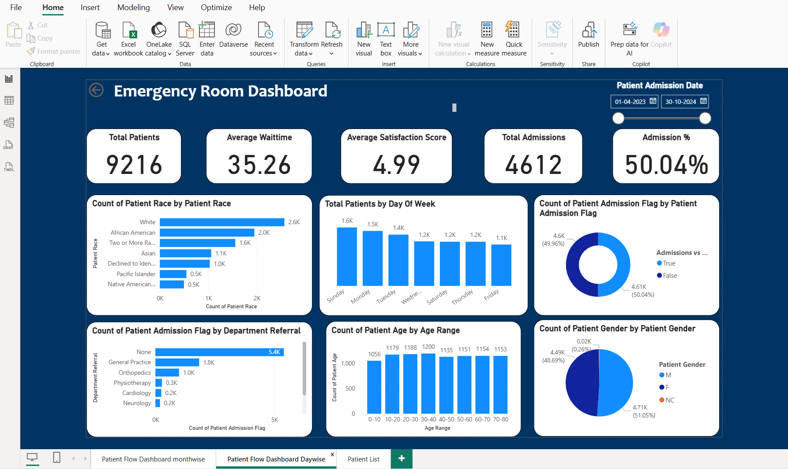
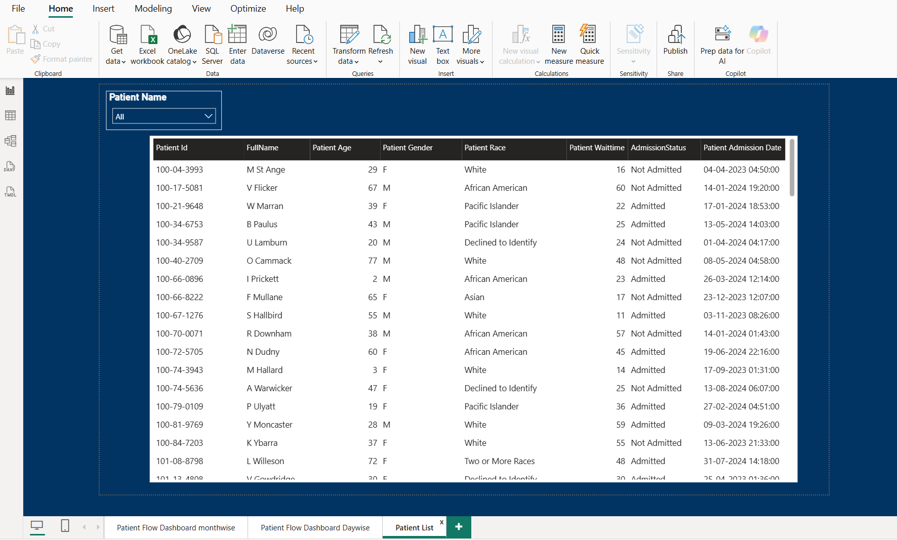

# Emergency Room Patient Flow Dashboard

## Project Overview

This Power BI dashboard analyzes Emergency Room (ER) patient flow using operational and demographic data. The goal of the project is to monitor patient volume, admissions, wait times, and referral patterns to support data-driven decision-making in hospital operations.

The dashboard provides a structured view of ER performance and allows interactive filtering by date and patient attributes.

---

## Business Objectives

This dashboard was built to answer the following operational questions:

- How many patients visited the ER during the selected period?
- What is the average patient wait time?
- What percentage of patients were admitted?
- How do admissions compare to non-admissions?
- Which days of the week experience higher patient volume?
- Which departments refer the most admitted patients?
- What demographic groups dominate ER visits?

---

## Key Performance Indicators (KPIs)

| KPI | Value (Current Dataset) |
|-----|--------------------------|
| Total Patients | 9,216 |
| Average Wait Time | 35.26 minutes |
| Average Satisfaction Score | 4.99 |
| Total Admissions | 4,612 |
| Admission Rate | 50.04% |

---

## Dashboard Pages

### 1. ER Overview Dashboard

Includes:

- Total patients, wait time, admissions, and admission percentage
- Patient distribution by race, gender, and age group
- Admissions vs Non-admissions comparison
- Day-of-week patient volume
- Department referral analysis
- Year and month filters for dynamic reporting

---

### 2. ER Dashboard – Date Analysis

Provides a time-based perspective using a date range slicer, allowing users to analyze trends across specific admission periods.

---

### 3. Patient-Level Detail Page

Includes a searchable and filterable patient list showing:

- Patient ID
- Full Name
- Age
- Gender
- Race
- Wait Time
- Admission Status
- Admission Date

This supports drill-down and detailed record-level review.

---

## Key Insights from the Analysis

- The dataset includes over 9,200 ER visits.
- Average patient wait time is approximately 35 minutes.
- About 50% of ER visits result in hospital admission.
- Sundays and Mondays show the highest patient volumes.
- The "None" category represents the largest share of department referrals, suggesting a high proportion of direct ER visits.
- Age distribution is relatively balanced, with slightly higher volume in the 20–60 age range.
- Gender distribution is nearly even.
- White patients represent the largest demographic group in the dataset.

---

## Data Modeling Approach

- Data transformed using Power Query.
- Relationships created between fact table and date/demographic dimensions.
- DAX measures implemented for KPIs including:
  - Total Patients
  - Average Wait Time
  - Total Admissions
  - Admission Rate (%)

The model supports interactive filtering and dynamic KPI recalculation.

---

## Tools & Technologies Used

- Power BI Desktop
- Power Query
- DAX
- CSV Data Source
- Data Modeling and Relationships

---

## Repository Structure

```
er-patient-flow-dashboard
│
├── screenshots/
│   ├── dashboard_page1.png
│   ├── dashboard_page2.png
│   └── patient_list.png
├── Emergency_Room_Dashboard.pbix
└── README.md
```

---

## Dashboard Preview

### ER Overview


### Date-Based Analysis


### Patient Detail Page


---

## How to Use

1. Download the `.pbix` file.
2. Open in Power BI Desktop.
3. Use the Year, Month, and Date slicers to filter the dashboard.
4. Navigate between pages to explore operational and patient-level insights.

---

## Notes

This project is intended as a portfolio demonstration of Power BI reporting, KPI development, and healthcare data analysis. The dataset used is for analytical demonstration purposes.
